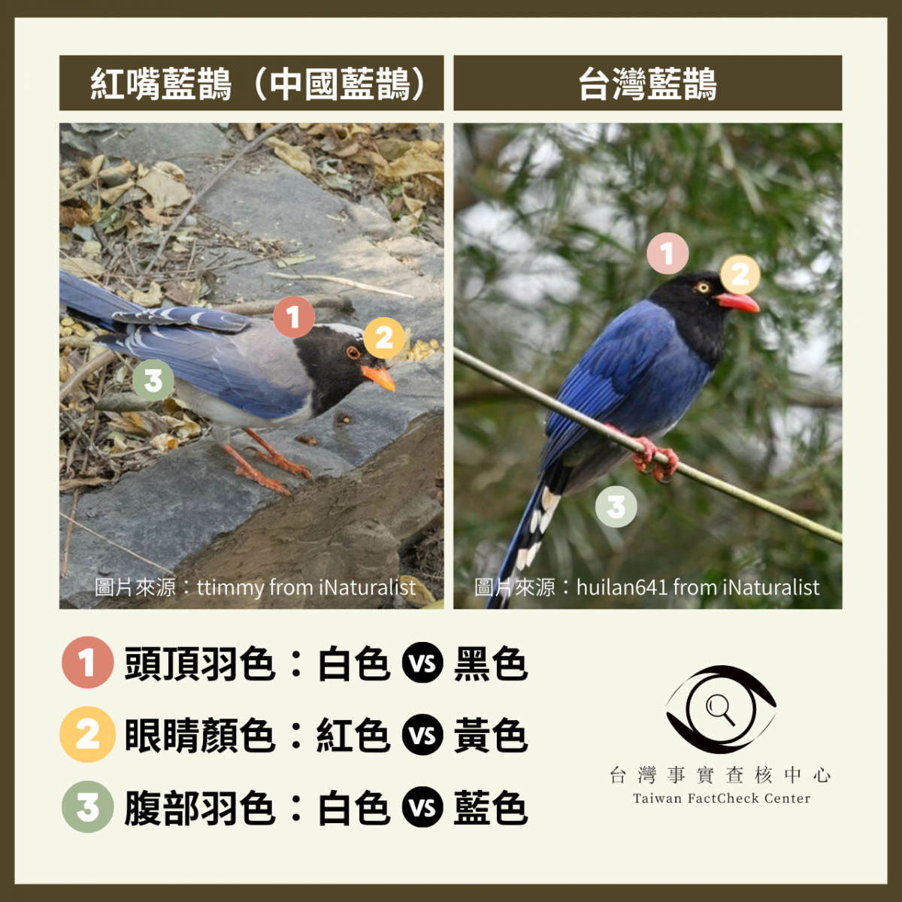

# Blue_Magpie-Recognizer
**The Final Project For Course: Introduction to Computer Vision and Its Applications.**

## 🔖 Abstract
- **台灣藍鵲 Taiwan Blue Magpie** (*Urocissa caerulea*) is the national bird of Taiwan, known for its striking blue plumage and long tail.
- The suspected smuggling of the **紅嘴藍鵲 Red-billed Blue Magpie** (*Urocissa erythroryncha*) into Taiwan has led to a gradual expansion of its population, threatening the habitat of the Taiwan Blue Magpie.
- This project aims to raise awareness of this issue and help people recognize and distinguish between the two species.

> 

### Blue Magpie Species
There are five kinds of blue magpies in the world:
| Chinese Name   | English Name               |
|----------------|----------------------------|
| 台灣藍鵲         | Taiwan Blue Magpie         |
| 紅嘴藍鵲         | Red-billed Blue Magpie     |
| 黃嘴藍鵲         | Yellow-billed Blue Magpie  |
| 白翅藍鵲         | White-winged Magpie        |
| 斯里蘭卡藍鵲      | Sri Lanka Blue Magpie      |

In this project, we selected three species with similar appearances: **Taiwan Blue Magpie**, **Red-billed Blue Magpie**, and **Yellow-billed Blue Magpie** as the dataset, aiming to train a model that can distinguish between them.

## 📋 TODO List
- [x] Dataset Preparation (using Selenium)
- [x] Model Building (using PyTorch)
- [x] Training and Evaluation (using PyTorch)
- [x] Hyperparameter Tuning
- [x] Model Visualization (using Captum)
- [x] UI Wrapping (using Gradio)

## 🎬 How to Start
### Prerequisites
- Python 3.10.x
- PyTorch 2.5.x
- CUDA 11.8

### Environment Setup
1. Clone this repository:
    ```bash
    git clone https://github.com/PuiPui32071/Blue_Magpie-Recognizer.git
    ```
2. Create a conda environment:
    ```bash
    conda create -n bmr python==3.10.15
    conda activate bmr
    ```
3. Install required packages:
    ```bash
    conda install pytorch==2.5.0 torchvision==0.20.0 torchaudio==2.5.0 pytorch-cuda=11.8 -c pytorch -c nvidia
    conda install scikit-learn
    conda install selenium tqdm torchinfo tensorboard ipywidgets
    conda install captum matplotlib==3.4.3 -c conda-forge
    pip install gradio
    conda install libpng jpeg  # for macOS
    pip install sympy==1.13.1  # if needed
    ```

## 📁 Dataset Preparation
### Option 1: Use Our Dataset
- If you want to use our proposed dataset, please [click here](https://drive.google.com/drive/folders/1E_pRJGIzvn5IInmIfg55CrSge5gsOnGE?usp=drive_link) to download `dataset_1500.zip`.
- Extract `dataset_1500.zip` to the root directory.
- It contains three different types of blue magpies images, with each class having `1500` images sized `256x256`.
- We also provide `raw_images.zip` for additional sampling options.

```
├── dataset_1500
│   ├── red-billed-blue-magpie
│   │   ├── 1.png
│   │   ├── 2.png
│   │   └── ...
│   ├── taiwan-blue-magpie
│   │   ├── 1.png
│   │   ├── 2.png
│   │   └── ...
│   └── yellow-billed-blue-magpie
│       ├── 1.png
│       ├── 2.png
│       └── ...
```

### Option 2: Use Custom Dataset
- To run Selenium properly, you need a driver that matches your browser, e.g., [Chrome](https://developer.chrome.com/docs/chromedriver/downloads?hl=zh-tw).
- Once downloaded, place the driver in the root directory.
- Then, modify `prepare_dataset.ipynb` and run the script to get the bird dataset you want.
- Note that you must pass the [media.ebird.org](https://media.ebird.org/catalog?taxonCode=formag1&mediaType=photo) URL with the specific species to the `EbirdCrawler` class so that the crawler can work properly.

```
├── dataset_<num_of_images>
│   ├── <species-1>
│   │   ├── 1.png
│   │   ├── 2.png
│   │   └── ...
│   ├── <species-2>
│   │   ├── 1.png
│   │   ├── 2.png
│   │   └── ...
│   └── <species-3>
│       ├── 1.png
│       ├── 2.png
│       └── ...
```

## 🏋️ Training
- To lower the cost of training and achieve maximum accuracy, we use the Pre-Trained **EfficientNetV2_s** from the paper: [EfficientNetV2: Smaller Models and Faster Training](https://arxiv.org/abs/2104.00298), and fine-tune it with our dataset.
- The `pipeline.ipynb` includes all the steps to construct and train our blue magpie recognizer. Just run it and have fun.
- Additionally, you can build your own model and save it in the `models` folder. Then, you can import it in the block and train it.
- During the program's execution, it automatically saves the TensorBoard logs in the `runs` folder, which you can use for better inspection.
- If you just want to do testing, we provide checkpoints in the `ckpts/effv2s_bn_0.001_10_0.5` folder. You can directly load the pre-trained model and use it.

## 🧪 Testing
- When training is done, the last 4 blocks in `pipeline.ipynb` show the training graphs, test images results, and some basic metrics to evaluate the model.

## ✔︎ Our Test Result
- Our trained model achieved nearly 95% accuracy on the test set.

    | Class                        | Precision | Recall | F1-Score | Support |
    |------------------------------|-----------|--------|----------|---------|
    | Red-billed-blue-magpie       | 0.9328    | 0.9289 | 0.9308   | 239     |
    | Taiwan-blue-magpie           | 0.9447    | 0.9610 | 0.9528   | 231     |
    | Yellow-billed-blue-magpie    | 0.9604    | 0.9463 | 0.9533   | 205     |
    | **Accuracy**                 |           |        | 0.9452   | 675     |
    | **Macro Avg**                | 0.9459    | 0.9454 | 0.9456   | 675     |
    | **Weighted Avg**             | 0.9452    | 0.9452 | 0.9452   | 675     |

## 👀 Model Interpretability
- As mentioned in the Abstract, our goal is to differentiate three types of blue magpies. The question is, does the model distinguish them as we do?
- You can run the `captum.ipynb` to see how the model interprets images. We use the method called **Occlusion Attribution** to show the important areas in the image. The darker green areas indicate that the model relies more on those areas to distinguish the bird.

## 🖥️ Gradio App
- It is inconvenient to change the image path in the code and run it every time we want to make a prediction. Therefore, we built a Gradio app that allows you to drag an image and immediately see the prediction and Captum heatmap.
- By running `gradio_app.ipynb`, you can access the testing interface in your browser.

### 🌟 Acknowledgement
- Thanks to [eBird.org](https://ebird.org/home) for providing such a platform with many valuable statistics for educational purposes :).
- Special thanks to the eBird team for their continuous efforts in maintaining and updating the database.
- We also appreciate the contributions of all the bird watchers and photographers who have shared their observations and images on eBird.